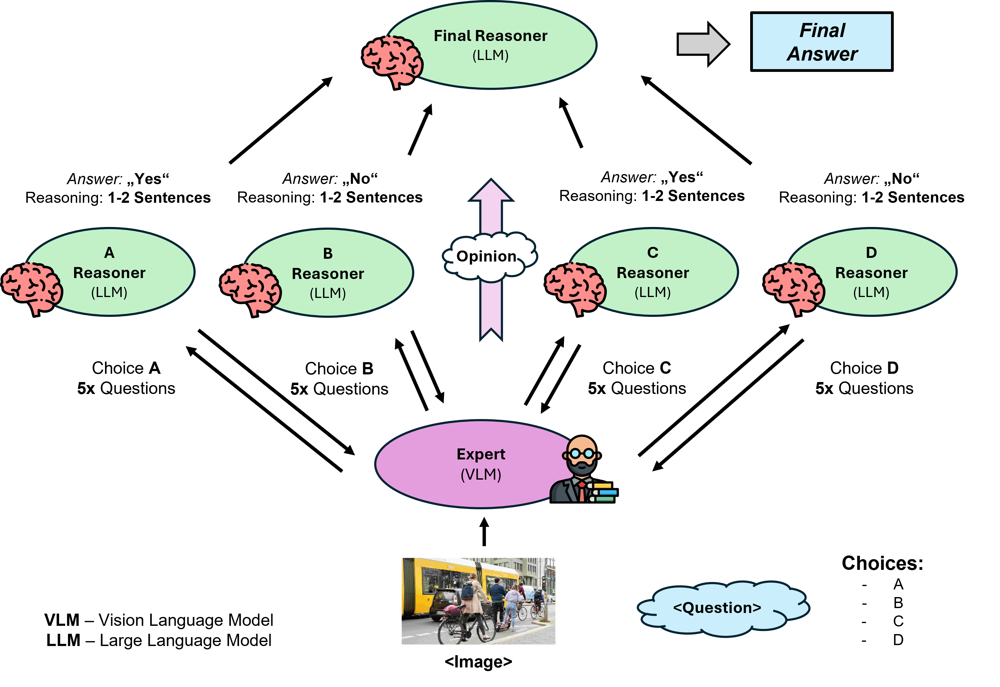

# Visual Reasoning Using Large Language and Visual Language Models
*This research project was conducted at the Technical University of Berlin, with equal contributions from Imene Ben Ammar, Daniel Richter, Anton Segeler, and Omadbek Meliev*

Links: [[Paper]](https://drive.google.com/file/d/12AodXtuvcAaPCCMcCflpRXdsF09bv3Bh/view?usp=sharing)

This project demonstrates an innovative approach combining Large Language Models (LLMs) and Visual Language Models (VLMs) to enhance visual reasoning. The solution leverages LLMs for question interpretation and VLMs for image analysis to deliver accurate answers for visual reasoning tasks.

## Table of Contents
1. [Introduction](#introduction)
2. [Methodology](#methodology)
3. [Setup and Requirements](#setup-and-requirements)
4. [Usage](#usage)
5. [Results](#results)
6. [References](#references)

## Introduction
The project aims to solve visual reasoning tasks by integrating LLMs and VLMs. We tested our approach on the A-OKVQA dataset, showing significant improvements in accuracy over existing methods. The key idea is that VLMs interpret the image and generate descriptions, while LLMs ask sub-questions to better understand the image, leading to a final decision.

## Methodology
The architecture comprises:
- **VLM**: We have one VLM that generates image captions and answers visual questions.
- **LLM**: There is 4 LLM's that takes each one answer choice and asks sub-questions and collects answers from VLM
- **LLM Final Reasonaer**: Collects all information and makes final decision which answer is corrcet
## Setup and Requirements

### Hardware
- The models were deployed on GPUs with a minimum of 55GB VRAM (e.g., Nvidia H100).
- Linux-based system (Ubuntu).

### Software
- Python 3.8+
- Required Python libraries can be installed via:

```bash
pip install -r requirements.txt
```

### Models
We used the following models:
- **LLaMA 3 (8B)**: For natural language processing it can be downlaoded [here](https://huggingface.co/meta-llama/Meta-Llama-3-8B).
- **LLaVA (7B)**: For image processing can be downlaoded [here](https://github.com/haotian-liu/LLaVA).

### Dataset
- The dataset used was A-OKVQA for visual question answering. You can find it [here](https://github.com/allenai/aokvqa).

## Usage

1. To run experiments you need to have inference of LLaMA and LLaVA. You can change to your endpoints in [Constants.py](./Constants.py)
   ```bash
   LLAVA_INFERENCE = 'http://127.0.0.1:5000'
   LLAMA_INFERENCE = 'http://10.0.64.103:5005/chat'
    ```
2. Then download the dataset A-OKVQA you can find it [here](https://github.com/allenai/aokvqa).

2. Clone the repository:
    ```bash
    git clone https://github.com/Omadzze/visual-reasoning.git
    cd visual-reasoning
    ```

2. Install dependencies:
    ```bash
    pip install -r requirements.txt
    ```

3. Run the code:
    ```bash
    python main.py
    ```

The model will process images and questions from the A-OKVQA dataset and generate answers using the LLM and VLM interaction.

## Results
The approach achieved an accuracy of **77.82%** on the A-OKVQA dataset, outperforming state-of-the-art methods like ViCor (75.60%). For more information please refer to our [paper](https://drive.google.com/file/d/12AodXtuvcAaPCCMcCflpRXdsF09bv3Bh/view?usp=sharing).

## References
- Zhou et al., *ViCor: Bridging Visual Understanding and Commonsense Reasoning with LLMs*, 2024.
- Liu et al., *Improved baselines with Visual Instruction Tuning*, 2024.
